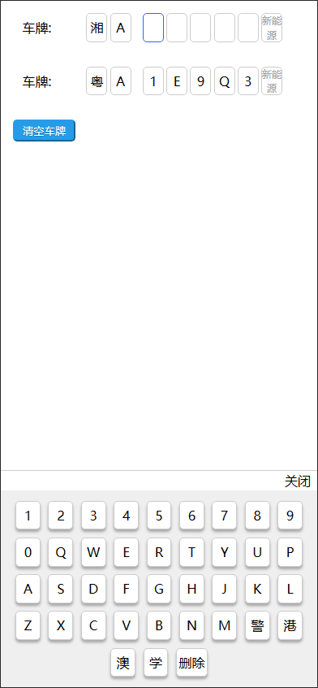
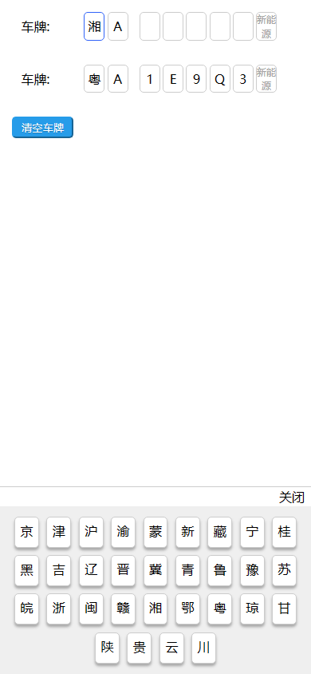

# licensePlateSelector
 
基于jquery的移动端H5车牌输入选择器


### 依赖 

* jquery

### 起步 


* 引入文件

> 引入 ```jqyery.js```、```licensePlateSelector.css```、```licensePlateSelector.js``` 文件，```jqyery.js``` 需要放置在 ```licensePlateSelector.js``` 之前。

``` html
<link rel="stylesheet" href="./licensePlateSelector.css">

<script type="text/javascript" src="./jquery-3.6.0.min.js"></script>
<script type="text/javascript" src="./licensePlateSelector.js"></script>
```

* 使用

``` html
<div id="demo"></div>
<button>清空车牌</button>
```

``` javascript
// 实例化
let licensePlateSelector = new LicensePlateSelector();
// 初始化
licensePlateSelector.init({
    elem: "#demo",  // 根元素id
    value: "湘A",   // 默认填充车牌
    activeIndex: 2,    // 默认选中下标 (从0开始，不传时，默认不选中)
    inputCallBack:function(val){ // 输入事件回调
        console.log(val);
        let plate_number = licensePlateSelector.getValue(); // 获取当前车牌
        console.log(plate_number);
    },
    deleteCallBack:function(){ // 键盘删除事件回调
        let plate_number = licensePlateSelector.getValue(); // 获取当前车牌
        console.log(plate_number);
    },
    closeKeyCallBack:function(){ // 关闭键盘事件回调
        console.log("键盘关闭");
    },
})
// 设置车牌
// licensePlateSelector.setValue("粤A1E9Q3")

// 清空车牌
$("button").click(function(){
    licensePlateSelector.clearValue();
})
```


### 参数

| 参数 | 类型 | 必填 | 说明 | 示例值 |
|--------|---------|--------|--------|--------|
| elem | String | 是 | 指定元素选择器 |"#demo"|
| value | String | 否 | 默认填充车牌 |"湘A"|
| activeIndex | number | 否 | 当前输入框下标，从0开始，不传时，默认不选中 |2|
| inputCallBack | function | 否 | 输入事件回调函数，返回参数：当前输入的值 ||
| deleteCallBack | function | 否 | 键盘删除事件回调函数 ||
| closeKeyCallBack | function | 否 | 关闭键盘事件回调函数 ||

### 方法

```getValue``` 获取当前车牌
```javascript
let plate_number = licensePlateSelector.getValue();
```

```setValue``` 设置车牌
```javascript
licensePlateSelector.setValue("粤A1E9Q3");
```

```clearValue``` 清空车牌
```javascript
licensePlateSelector.clearValue();
```

### 截图




### END

github地址：https://github.com/pxsgdsb/licensePlateSelector

gitee地址：https://gitee.com/PxStrong/licensePlateSelector

如果觉得对你还有些用，顺手点一下star吧。

